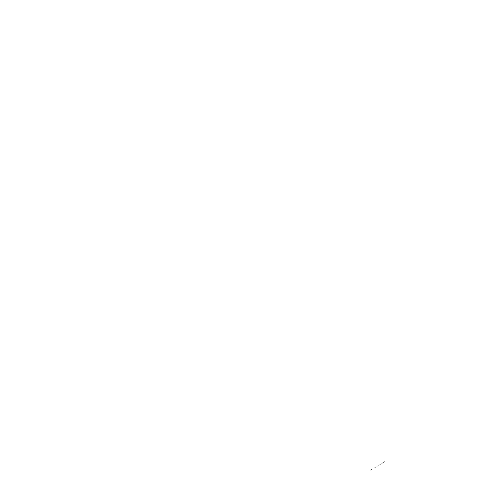

![views] ![stars] ![forks] ![issues] ![license] ![repo-size]

<picture>
  <source media="(prefers-color-scheme: dark)" srcset="./public/nextjs-light.svg">
  <source media="(prefers-color-scheme: light)" srcset="./public/nextjs-dark.svg">
  
</picture>

# Khushal's Portfolio

## A Modern & Minimal Portfolio to showcase my work and skills

- Currently under development

## License

This project is licensed under the MIT License - see the [LICENSE](LICENSE) file for details.

## Contributors

[![][contributors]][contributors-graph]

_Note: It may take up to 24h for the [contrib.rocks][contrib-rocks] plugin to update because it's refreshed once a day._

<!----------------------------------{ Labels }--------------------------------->

[views]: https://komarev.com/ghpvc/?username=portfolio&label=view%20counter&color=red&style=flat
[repo-size]: https://img.shields.io/github/repo-size/Khushal-ag/portfolio
[issues]: https://img.shields.io/github/issues-raw/Khushal-ag/portfolio
[license]: https://img.shields.io/github/license/Khushal-ag/portfolio
[forks]: https://img.shields.io/github/forks/Khushal-ag/portfolio?style=flat
[stars]: https://img.shields.io/github/stars/Khushal-ag/portfolio
[contributors]: https://contrib.rocks/image?repo=Khushal-ag/portfolio&max=500
[contributors-graph]: https://github.com/Khushal-ag/portfolio/graphs/contributors
[contrib-rocks]: https://contrib.rocks/preview?repo=Khushal-ag%2Fportfolio
